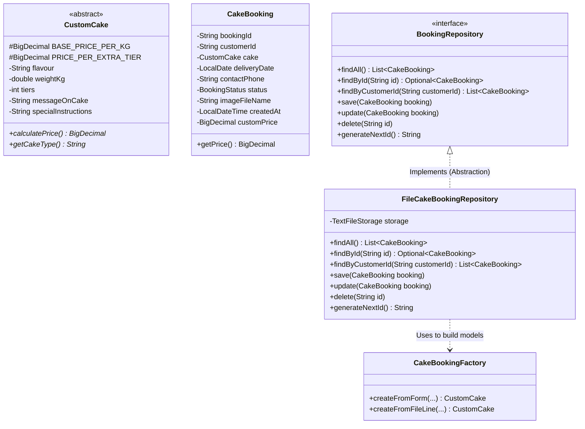

# Custom Cake Booking Class Diagram

```mermaid
classDiagram
    class CustomCake {
        <<abstract>>
        #BigDecimal BASE_PRICE_PER_KG
        #BigDecimal PRICE_PER_EXTRA_TIER
        -String flavour
        -double weightKg
        -int tiers
        -String messageOnCake
        -String specialInstructions
        +calculatePrice()* BigDecimal
        +getCakeType()* String
    }

    class CakeBooking {
        -String bookingId
        -String customerId
        -CustomCake cake
        -LocalDate deliveryDate
        -String contactPhone
        -BookingStatus status
        -String imageFileName
        -LocalDateTime createdAt
        -BigDecimal customPrice
        +getPrice() BigDecimal
    }

    class CakeBookingFactory {
        +createFromForm(...) CustomCake
        +createFromFileLine(...) CustomCake
    }

    class BookingRepository {
        <<interface>>
        +findAll() List~CakeBooking~
        +findById(String id) Optional~CakeBooking~
        +findByCustomerId(String customerId) List~CakeBooking~
        +save(CakeBooking booking)
        +update(CakeBooking booking)
        +delete(String id)
        +generateNextId() String
    }

    class FileCakeBookingRepository {
        -TextFileStorage storage
        +findAll() List~CakeBooking~
        +findById(String id) Optional~CakeBooking~
        +findByCustomerId(String customerId) List~CakeBooking~
        +save(CakeBooking booking)
        +update(CakeBooking booking)
        +delete(String id)
        +generateNextId() String
    }

    BookingRepository <|.. FileCakeBookingRepository : Implements (Abstraction)
    FileCakeBookingRepository ..> CakeBookingFactory : Uses to build models
```
